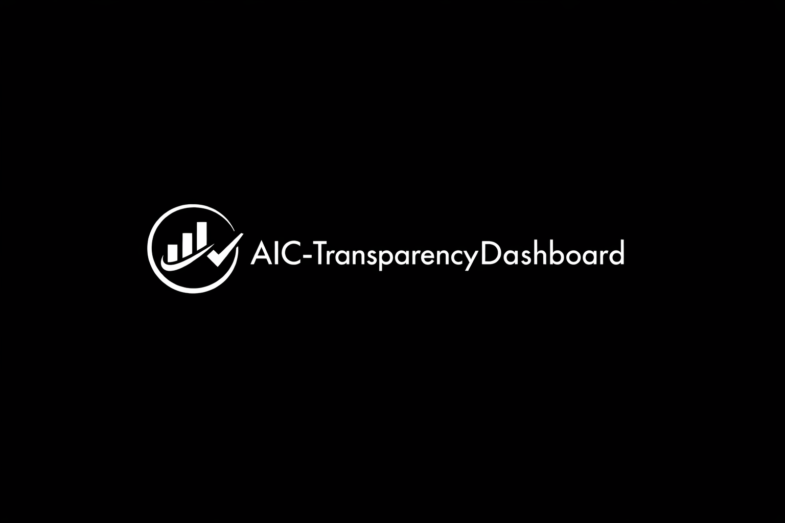

# AIC-TransparencyDashboard

**Official Transparency & Governance Dashboard** of  
**Adaptive Intelligence Circle (AIC) & Human Meaning Network (HMN)**

<p align="center">
  
</p>

### Vision
AIC-TransparencyDashboard provides real-time, public, and auditable visibility into every aspect of the AIC/HMN ecosystem — from code changes and policy updates to ethical compliance and governance decisions.

It exists to prove that **true third path independence** is possible through radical transparency.

### Core Principles
- **Radical transparency**: Everything that can be public should be public.
- **Ethical metrics**: Real-time tracking of adherence to zero-donation, third path, and ethical-from-kernel.
- **No hidden operations**: No backdoors, no secret governance, no undisclosed partnerships.
- **Public audit trail**: All actions are logged and verifiable by anyone.
- **GPLv3.0 licensed**: Full open source with ethical constraints.

### Structure 
``` pgsql 
AIC-TransparencyDashboard/
├── README.md                          # Trang chính + mục đích minh bạch
├── LICENSE                            # GPLv3.0
├── CODE_OF_CONDUCT.md
├── CONTRIBUTING.md
├── SECURITY.md
├── GOVERNANCE.md
├── POLICIES/
│   ├── TRANSPARENCY-POLICY.md         # Chính sách minh bạch
│   ├── ETHICAL-METRICS.md             # Metrics đạo đức
│   └── ZERO-DONATION-POLICY.md
├── src/                               # Code chính (dashboard)
│   ├── backend/                       # API + audit log
│   ├── frontend/                      # UI (React/Vue hoặc TUI)
│   ├── core/                          # Transparency Engine
│   └── metrics/                       # Ethical & governance metrics
├── tests/                             # Tests
├── scripts/                           # Deployment & audit scripts
├── docs/
│   ├── architecture.md
│   └── user-guide.md
├── public/                            # Static files (nếu có frontend)
├── data/                              # Public audit logs (sample)
├── examples/                          # Demo dashboard
├── ANNOUNCEMENTS/
│   └── YYYY-MM-Status.md
├── HISTORY/
│   └── CHANGELOG.md
└── CONTACT.md
``` 

### Key Features (in development)
- Live governance dashboard
- Ethical compliance metrics
- Public audit log of all core decisions
- Real-time repository health monitor
- Transparent contribution & maintainer activity
- Historical announcement archive

### Current Status (April 2026)
This dashboard is being built to maintain public trust and accountability, especially during the Founder’s upcoming mandatory military service (2027–2029).

It will serve as the single source of truth for the entire AIC community and external observers.

**Part of the larger AIC ecosystem**:  
[Adaptive Intelligence Circle](https://github.com/AdaptiveIntelligenceCircle)

**License**: GPLv3.0 with Ethical Use Addendum (see `/POLICIES`)

**Maintained by**: Nguyễn Đức Trí (Founder & Architect)
